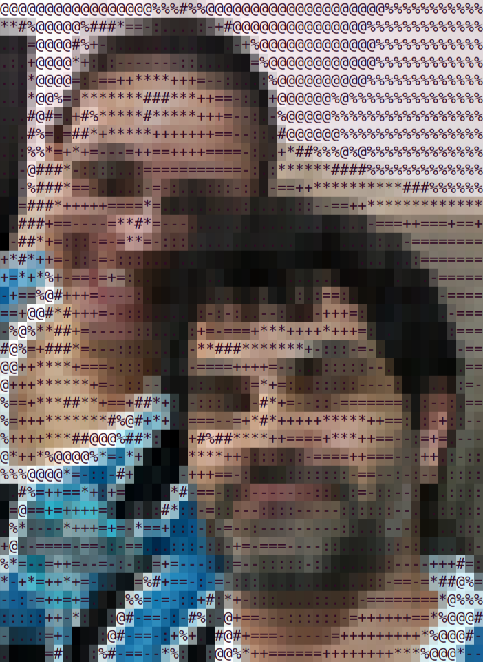
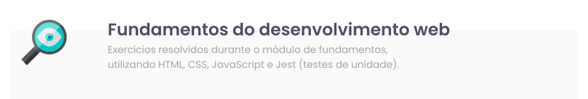
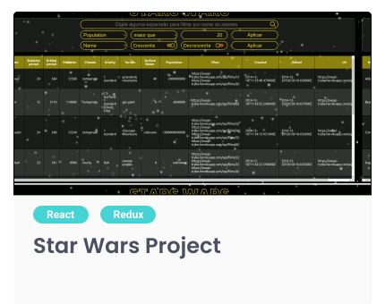
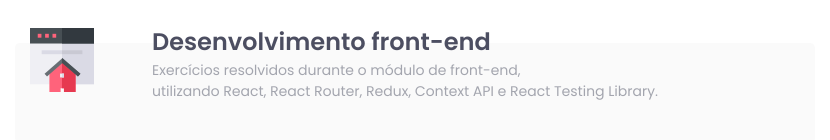
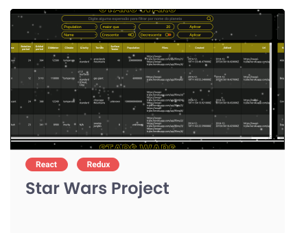
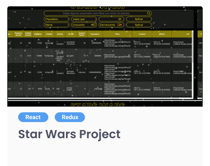
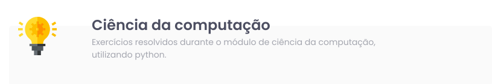
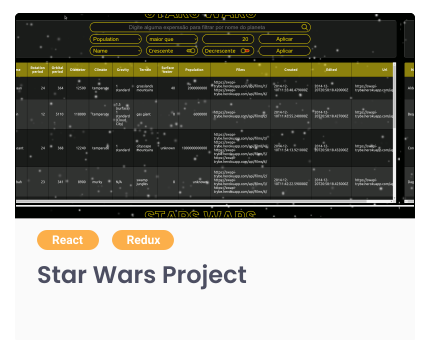

  

  # Who I am
  

## Hey 🖖, I'm Luciano Berchon
 

<table width="100%">
    <tr>
        <td valign="top" width="70%">
            

- 💼 I'm a Full Stack (Junior) Developer from Brazil
- 🌱 I'm currently learning Python and C#
- 😍 I'm a technology enthusiast
- 🤔 My interests are machine learning and AI
- 🎓 I have a bachelor's degree in physics and a master's degree in mechanical engineering
- 💬 Ask me about anything, I'll be happy if I can help you
            

        </td>
        <td>
            
        </td>
    </tr>
</table>

  

  
  # My Projects (Readme in development)
  

<!-- FUNDAMENTOS -->

Clique para expandir

<table width="100%">
    <tr>
        <td width="50%">
            
        </td>
        <td width="50%">
            
        </td>
    </tr>
</table>

  

---

<!-- FRONTEND -->

Clique para expandir

<table width="100%">
    <tr>
        <td width="50%">
            
        </td>
        <td width="50%">
            
        </td>
    </tr>
</table>

  

---

<!-- BACKEND -->

Clique para expandir

<table width="100%">
    <tr>
        <td width="50%">
            
        </td>
        <td width="50%">
            
        </td>
    </tr>
</table>

  

---

<!-- CIÊNCIA DA COMPUTAÇÃO -->

Clique para expandir

<table width="100%">
    <tr>
        <td width="50%">
            
        </td>
        <td width="50%">
            
        </td>
    </tr>
</table>

  

---

  

  
  # Languages and Tools (Readme in development)
  

Coming soon 😌 😅

  

  
  # Connect with me
  

  

  
  # Statistics (Readme in development)
  

Coming soon 😌 😅

